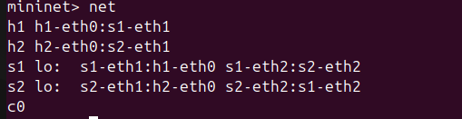
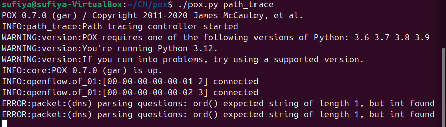

# Path Tracing Tool using SDN and Mininet

---

##  Problem Statement

In traditional networks, it is difficult to observe the exact path taken by packets.
This project implements an SDN-based path tracing tool using Mininet and a POX controller to identify and display the forwarding path of packets in real time.

---

##  Objective

* Track packet flow using SDN controller
* Identify forwarding path across switches
* Display route taken by packets
* Validate behavior using testing tools (ping, iperf, Wireshark)

---

##  Topology

* 2 Hosts: h1, h2
* 2 Switches: s1, s2
* 1 POX Controller (c0)

Topology structure:

```

h1 ── s1 ── s2 ── h2
```
### Topology Output

---

##  SDN Logic & Flow Rules

###  Packet-In Handling

* When a packet arrives without a matching rule, the switch sends a **packet_in** event to the controller
* Controller learns MAC-to-port mapping dynamically

###  Flow Rule Design

* Match: Source MAC, Destination MAC
* Action: Forward to correct output port
* Controller installs rules using `flow_mod`

###  Path Tracing Logic

* Each packet’s path is tracked across switches
* Path is printed in controller logs:

```
Path: h1 → s1 → s2 → h2
```
### Controller Connection

---

##  Setup & Execution

### 1.  Start Controller

```bash
cd ~/pox
./pox.py path_trace
```

### 2.  Start Mininet

```bash
sudo mn -c
sudo mn --controller=remote,ip=127.0.0.1,port=6633 --topo linear,2
```

---

## 3.  Test Scenarios

### Scenario 1: Normal Operation

```bash
mininet> pingall
```

Expected:

```
0% dropped (2/2 received)
```
### Pingall Result


### Path Trace Output


---
Controller Output:

```
Path: h1 → s1 → s2 → h2
Path: h2 → s2 → s1 → h1
```

---

###  Scenario 2: Link Failure

```bash
mininet> link s1 s2 down
mininet> pingall
```

Expected:

```
100% dropped
```
### Failure Test


---

## 4. Performance Analysis

###  Latency (Ping)

```bash
mininet> h1 ping -c 5 h2
```
### Ping Latency


* Measures round-trip delay between hosts
* Shows latency in milliseconds

---

###  Throughput (iperf)

```bash
mininet> h2 iperf -s &
mininet> h1 iperf -c 10.0.0.2 -t 10
```
### Iperf Result


* Measures bandwidth between hosts
* Output in Mbits/sec

---

###  Flow Table

```bash
sudo ovs-ofctl dump-flows s1
```


* Displays OpenFlow rules installed by controller
* Shows match-action behavior

---

###  Port Statistics

```bash
mininet> dpctl dump-ports
```


* Displays packet count and byte statistics

---

###  Wireshark Analysis
### Wireshark Capture


* ICMP packets captured during ping
* Echo Request and Reply confirm communication

---

## 5. Proof of Execution

All screenshots are available in the `/screenshots` folder:

* controller_connected.png
* topology.png
* pingall.png
* path_trace.png
* ping_latency.png
* failure.png
* flow_table.png
* wireshark_icmp.png
* iperf.png
* port_stats.png

---

##  Results

* Successful packet forwarding
* Accurate path tracing across switches
* Dynamic flow rule installation
* Network behavior observed under normal and failure conditions

---

##  Conclusion

This project demonstrates how SDN enables centralized control of network behavior.
The controller dynamically installs flow rules and tracks packet paths, providing visibility into network operations and improving understanding of SDN principles.
